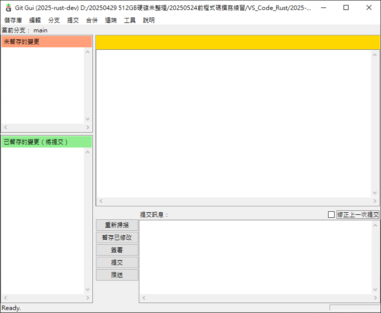
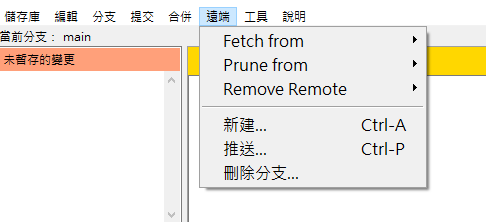

### 關於 Git 官方多語系支援政策調整（2.30.x 之後）  

自 2021 年（Git 2.30 版）起，Git 官方對於多語系（i18n, l10n）支援政策進行了一些調整。主要變化包括  

 - 加強對各語言社群參與翻譯的鼓勵，但同時將部分 GUI 或次要元件的在地化從官方 release 流程中移出，改由社群自發維護。  
 - 官方優先維護核心 Git 指令的翻譯，GUI 工具（如 git-gui）及其語系檔案則需社群額外貢獻。  
 - 翻譯專案逐步從舊有平台（如 po/git-gui.pot）過渡到更現代化的協作模式（如 Weblate 等）。  
 - 版本更新時，語系檔常因原文調整、功能增刪，導致翻譯需頻繁同步及修正。  
這些政策變動意味著，git-gui 的新版本若要有完整的中文（台灣）語系支援，需社群自行維護與更新翻譯檔案。  

### 本倉庫中文化 Git GUI 0.21（Git 2.49）的挑戰  

本倉庫嘗試針對 git-gui 0.21（隨 Git 2.49 發布）進行全面中文化，主要挑戰包含  

1. 原文頻繁變動： 隨著 git-gui 功能增減、介面調整，原文（英文）字串常有修改，中文語系檔需不斷追蹤原專案更新。  
2. 缺乏官方同步： 由於官方已不主動維護 git-gui 的語系更新，社群需手動比對、補齊、修正語系檔案。  
3. 技術門檻： git-gui 採用 Tcl 撰寫，語系檔案格式較為特殊，需要瞭解 Tcl 語法與國際化處理方式。  
4. 翻譯一致性與品質控管： 語意、專有名詞、操作說明需保持一致，且不同貢獻者需協調翻譯風格。  

### Git GUI 主畫面中文化  

  

### Git GUI 呼叫外部Tcl/Tk 功能  

  

  

### 中文化注意事項  

 - Git工具源於UNIX作業系統，相關文件檔案編碼**必須**使用ANSI格式儲存。  

### 使用方式  

下載倉庫中的檔案後，再對相關檔案進行覆蓋前，請先將原檔案複製一份複本(方便要回到英文版時有原檔可用)，再將倉庫中的檔案複製覆蓋，之後重啟Git GUI就是像截圖一樣全中文了(未來努力完全中文化中)。  

### 版本變革  

 - v0.1版中文化程度  
     - 針對git for windows 2.30之後對多語系支援調整(只剩英文)  
     - git-gui.tcl主檔案內所有有關英文字串翻譯成中文。  
     - 其他.tcl檔及Tcl/Tk內建元件尚未翻譯中文。  

測試流程繁瑣： 每次語系更新後需要完整測試軟體介面，確保翻譯不會導致顯示錯誤或功能異常。  
歡迎社群一同參與 git-gui 的中文化工作，如有建議或發現錯誤，請不吝指正或提交 PR。  
